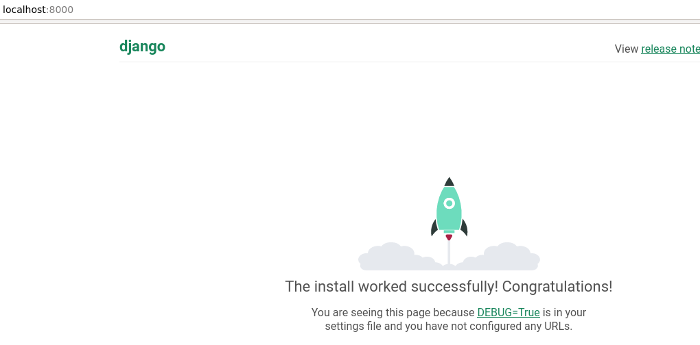
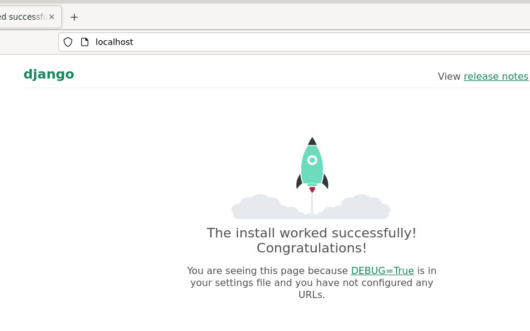

# Configuration Management Project

## What is it: 

My task was to Deploy Django 4 Production installation as a salt state. Django is a framework for full-stack web application development.

## Execution: 
I started this task by installing salt minion and salt master on my virtual machine. 

```
sudo apt-get install -y  salt-minion salt-master
salt --version
```

Then I created a the init.sls file to srv/salt/django/ and created my first command there: 

```                                  
Install apps:
  pkg.installed:
    - name: Apache2
    - name: virtualenv

create_directory:
  file.directory:
  - name: ~jyri/publicwsgi
``` 

and run it.

```
Summary for local
------------
Succeeded: 2 (changed=2)
Failed:    0
------------
Total states run:     1
Total run time:  19.516 s
``` 

Then once that was done I edited the init.sls file to create a virtual environment. I did some googling and found this:
https://docs.saltproject.io/en/latest/ref/states/all/salt.states.virtualenv_mod.html
So I by these and Tero's instructions
https://terokarvinen.com/2022/django-instant-crm-tutorial/

I created a requirements.txt file, wrote django in it and saved it on the srv/salt/django directory. After I created another salt state:

```
/home/jyri/publicwsgi/env:
  virtualenv.managed:
    - system_site_packages: true
    - requirements: salt://django/requirements.txt
```
and run it. 

```
----------
          ID: /home/jyri/publicwsgi/env
    Function: virtualenv.managed
      Result: True
     Comment: Created new virtualenv
     Started: 13:34:45.133870
    Duration: 7685.57 ms
     Changes:   
              ----------
              new:
              packages:
                  ----------
                  new:
                      - sqlparse==0.4.2
                      - asgiref==3.5.2
                      - Django==4.0.4
                  old:

Summary for local
------------
Succeeded: 3 (changed=1)
Failed:    0
------------
Total states run:     3
Total run time:   7.738 s
``` 

I checked and now I had a new virtual environment on my homefolder/publicwsgi directory. 

After this it was time to start a project. I did not find any other way to do this except cmd.run state. 

So I did

```
source /home/jyri/publicwsgi/env/bin/activate && django-admin startproject testproject:
  cmd.run
``` 
and run this. I browsed the home and publicwsgi folder and did not see anything so I run it again.

``` 
----------
          ID: source /home/jyri/publicwsgi/env/bin/activate && django-admin startproject testproject
    Function: cmd.run
      Result: False
     Comment: Command "source /home/jyri/publicwsgi/env/bin/activate && django-admin startproject testproject" run
     Started: 13:51:55.625322
    Duration: 282.808 ms
     Changes:   
              ----------
              pid:
                  8551
              retcode:
                  1
              stderr:
                  CommandError: '/root/testproject' already exists
              stdout:
``` 

Looks like it created the project to root. WHOOPS. I did some digging and realised I need to add cwd to the state. So I edited it:

``` 
source /home/jyri/publicwsgi/env/bin/activate && django-admin startproject testproject:
  cmd.run:
    - cwd: /home/jyri/publicwsgi/
``` 

and run it again. 

```
----------
          ID: source /home/jyri/publicwsgi/env/bin/activate && django-admin startproject testproject
    Function: cmd.run
      Result: True
     Comment: Command "source /home/jyri/publicwsgi/env/bin/activate && django-admin startproject testproject" run
     Started: 14:20:35.663745
    Duration: 364.663 ms
     Changes:   
              ----------
              pid:
                  8733
              retcode:
                  0
              stderr:
              stdout:

Summary for local
------------
Succeeded: 4 (changed=1)
Failed:    0
------------
Total states run:     4
Total run time:   5.891 s
``` 

Yeah, Now I had the project created. The state was not idempotent as we saw on the root fiasco so I added one more command there.
https://docs.saltproject.io/en/latest/ref/states/requisites.html

```
source /home/jyri/publicwsgi/env/bin/activate && django-admin startproject testproject:
  cmd.run:
    - cwd: /home/jyri/publicwsgi/
    - unless: test /home/jyri/publicwsgi/testproject
```

Tried running it now. 

```
----------
          ID: source /home/jyri/publicwsgi/env/bin/activate && django-admin startproject testproject
    Function: cmd.run
      Result: True
     Comment: unless condition is true
     Started: 14:34:08.222824
    Duration: 437.251 ms
     Changes:   

Summary for local
------------
Succeeded: 4
Failed:    0
------------
Total states run:     4
Total run time:   5.173 s
```

Now it is idempotent. I tried to run this manually right now. I opened up a terminal, browsed to the project and wrote

```
./manage.py runserver
```

I go a complain that it was unable to open a database file. For some reason, when I run the init.sls file it creates the project, but it doesnt create a database file. It does create it when I manually run the commands on terminal. I tried to solve this for an hour, but didnt find any solution for it online or locally so I created a workaround. I copied the database file from the manual installation to my init.sls folder and created a new state that copies that file to the project: 

```
/home/jyri/publicwsgi/testi/db.sqlite3:
  file.managed:
    - source: salt://django/db.sqlite3
```
And run it:

```
----------
          ID: source /home/jyri/publicwsgi/env/bin/activate && django-admin startproject testi
    Function: cmd.run
      Result: True
     Comment: Command "source /home/jyri/publicwsgi/env/bin/activate && django-admin startproject testi" run
     Started: 15:29:13.071863
    Duration: 686.834 ms
     Changes:   
              ----------
              pid:
                  10678
              retcode:
                  0
              stderr:
              stdout:
----------
          ID: /home/jyri/publicwsgi/db.sqlite3
    Function: file.managed
      Result: True
     Comment: File /home/jyri/publicwsgi/db.sqlite3 updated
     Started: 15:29:13.759047
    Duration: 7.593 ms
     Changes:   
              ----------
              diff:
                  New file
              mode:
                  0644

Summary for local
------------
Succeeded: 5 (changed=2)
Failed:    0
------------
Total states run:     5
Total run time:   5.552 s
```


I tried running the init.sls file again and opened up a terminal and tried to run the server. Now it worked and I could see from localhost that the site was working.



Now it was time to put it to deployment. I created a new file to the salt/django directory called testi.conf:

```
Define TDIR /home/jyri/publicwsgi/testi
Define TWSGI /home/jyri/publicwsgi/testi/testi/wsgi.py
Define TUSER jyri
Define TVENV /home/jyri/publicwsgi/env/lib/python3.9/site-packages
# See https://terokarvinen.com/2022/deploy-django/

<VirtualHost *:80>
        Alias /static/ ${TDIR}/static/
        <Directory ${TDIR}/static/>
                Require all granted
        </Directory>

        WSGIDaemonProcess ${TUSER} user=${TUSER} group=${TUSER} threads=5 python-path="${TDIR}:${TVENV}"
        WSGIScriptAlias / ${TWSGI}
        <Directory ${TDIR}>
             WSGIProcessGroup ${TUSER}
             WSGIApplicationGroup %{GLOBAL}
             WSGIScriptReloading On
             <Files wsgi.py>
                Require all granted
             </Files>
        </Directory>

</VirtualHost>

Undefine TDIR
Undefine TWSGI
Undefine TUSER
Undefine TVENV
```

I created the state to copy the testi.conf file to apache2 sites-available directory.

```
/etc/apache2/sites-available/testi.conf:
  file.managed:
    - source: salt://django/testi.conf
```

And run it: 

```
----------
          ID: /etc/apache2/sites-available/testi.conf
    Function: file.managed
      Result: True
     Comment: File /etc/apache2/sites-available/testi.conf updated
     Started: 15:41:55.066874
    Duration: 32.24 ms
     Changes:   
              ----------
              diff:
                  --- 
                  +++ 
                  @@ -1,32 +1,29 @@
                  +Define TDIR /home/jyri/publicwsgi/testi
                  +Define TWSGI /home/jyri/publicwsgi/testi/testi/wsgi.py
                  +Define TUSER jyri
                  +Define TVENV /home/jyri/publicwsgi/env/lib/python3.9/site-packages
                  +# See https://terokarvinen.com/2022/deploy-django/
                  +
                   <VirtualHost *:80>
                  -	# The ServerName directive sets the request scheme, hostname and port that
                  -	# the server uses to identify itself. This is used when creating
                  -	# redirection URLs. In the context of virtual hosts, the ServerName
                  -	# specifies what hostname must appear in the request's Host: header to
                  -	# match this virtual host. For the default virtual host (this file) this
                  -	# value is not decisive as it is used as a last resort host regardless.
                  -	# However, you must set it for any further virtual host explicitly.
                  -	#ServerName www.example.com
                  +        Alias /static/ ${TDIR}/static/
                  +        <Directory ${TDIR}/static/>
                  +                Require all granted
                  +        </Directory>
                   
                  -	ServerAdmin webmaster@localhost
                  -	DocumentRoot /var/www/testi/
                  -	ServerName testi.com
                  +        WSGIDaemonProcess ${TUSER} user=${TUSER} group=${TUSER} threads=5 python-path="${TDIR}:${TVENV}"
                  +        WSGIScriptAlias / ${TWSGI}
                  +        <Directory ${TDIR}>
                  +             WSGIProcessGroup ${TUSER}
                  +             WSGIApplicationGroup %{GLOBAL}
                  +             WSGIScriptReloading On
                  +             <Files wsgi.py>
                  +                Require all granted
                  +             </Files>
                  +        </Directory>
                   
                  -	# Available loglevels: trace8, ..., trace1, debug, info, notice, warn,
                  -	# error, crit, alert, emerg.
                  -	# It is also possible to configure the loglevel for particular
                  -	# modules, e.g.
                  -	#LogLevel info ssl:warn
                  -
                  -	ErrorLog ${APACHE_LOG_DIR}/error.log
                  -	CustomLog ${APACHE_LOG_DIR}/access.log combined
                  -
                  -	# For most configuration files from conf-available/, which are
                  -	# enabled or disabled at a global level, it is possible to
                  -	# include a line for only one particular virtual host. For example the
                  -	# following line enables the CGI configuration for this host only
                  -	# after it has been globally disabled with "a2disconf".
                  -	#Include conf-available/serve-cgi-bin.conf
                   </VirtualHost>
                   
                  -# vim: syntax=apache ts=4 sw=4 sts=4 sr noet
                  +Undefine TDIR
                  +Undefine TWSGI
                  +Undefine TUSER
                  +Undefine TVENV

Summary for local
------------
Succeeded: 6 (changed=1)
Failed:    0
------------
Total states run:     6
Total run time:   5.148 s
```
Then I created two states that disable the default conf file and enables the new one:

https://docs.saltproject.io/en/latest/ref/modules/all/salt.modules.deb_apache.html
https://docs.saltproject.io/en/latest/ref/states/all/salt.states.apache_site.html

```
disable default site:
  apache_site.disabled:
    - name: 000-default

enable default site:
  apache_site.enabled:
    - name: testi.conf
```

and run it: 

```
----------
          ID: disable default site
    Function: apache_site.disabled
        Name: 000-default
      Result: True
     Comment: 
     Started: 15:54:42.080682
    Duration: 81.668 ms
     Changes:   
              ----------
              new:
                  None
              old:
                  000-default
----------
          ID: enable default site
    Function: apache_site.enabled
        Name: testi.conf
      Result: True
     Comment: 
     Started: 15:54:42.162663
    Duration: 64.959 ms
     Changes:   
              ----------
              new:
                  testi.conf
              old:
                  None

Summary for local
------------
Succeeded: 8 (changed=2)
Failed:    0
------------
Total states run:     8
Total run time:   5.875 s
```


Once that was done, I looked more of tero's instructions. Looks like I need to install Apache WSGI module, so that Apache learns what your WSGI commands mean.

so I once again edited init.sls file

```
Install apps:
  pkg.installed:
    - name: Apache2
    - name: virtualenv
    - name: libapache2-mod-wsgi-py3
```

So now my whole init.sls file looks like this: 

```
  pkg.installed:
    - name: Apache2
    - name: virtualenv
    - name: libapache2-mod-wsgi-py3

create_directory:
  file.directory:
  - name: ~jyri/publicwsgi


/home/jyri/publicwsgi/env:
  virtualenv.managed:
    - system_site_packages: true
    - -p: python3
    - requirements: salt://django/requirements.txt

source /home/jyri/publicwsgi/env/bin/activate && django-admin startproject testi:
  cmd.run:
    - cwd: /home/jyri/publicwsgi/
    - unless: test -d /home/jyri/publicwsgi/testi

/home/jyri/publicwsgi/testi/db.sqlite3:
  file.managed:
    - source: salt://django/db.sqlite3

/etc/apache2/sites-available/testi.conf:
  file.managed:
    - source: salt://django/testi.conf

disable default site:
  apache_site.disabled:
    - name: 000-default

enable_default_site:
  apache_site.enabled:
    - name: testi.conf
```

I run this and rebooted Apache2. 

Went to localhost and yeah, it works!!! 

Next, lets disable debug. I copied the settings.py file from the project and pasted it into my salt folder.

I edited it: 

```
DEBUG = False
```

Then I modified the init.sls file:

```
/home/jyri/publicwsgi/testi/testi/settings.py:
  file.managed:
    - source: salt://django/settings.py
```

And run it:

```
----------
          ID: /home/jyri/publicwsgi/testi/testi/settings.py
    Function: file.managed
      Result: True
     Comment: File /home/jyri/publicwsgi/testi/testi/settings.py updated
     Started: 17:17:37.449405
    Duration: 67.395 ms
     Changes:   
              ----------
              diff:
                  --- 
                  +++ 
                  @@ -23,7 +23,7 @@
                   SECRET_KEY = 'django-insecure-SALAISUUS'
                   
                   # SECURITY WARNING: don't run with debug turned on in production!
                  -DEBUG = True
                  +DEBUG = False
                   
                   ALLOWED_HOSTS = []                   
```


## Running in a new virtual environment

I installed a new virtual machine to try this module.

I installed salt-master, copied the files I created and run the module:

For some weird reason it only installed the last application that was in the pkg.installed list so libapache2-mod-wsgi-py3. 

I decided to make a separate state for all the installation files:

```
Install apache2:
  pkg.installed:
    - name: apache2

install virtualenv:
  pkg.installed:
    - name: virtualenv

install libapache:
  pkg.installed:
    - name: libapache2-mod-wsgi-py3
```

Then I tried to run it again. Now it worked. Then I restarted apache:

```
sudo systemctl restart apache2
```

I got error: 
Invalid command WSGIDaemonProcess Deploy Django application.

I googled it and found this article: 

[https://stackoverflow.com/questions/33320889/invalid-command-wsgidaemonprocess-deploy-django-application-on-centos-6-7](https://stackoverflow.com/questions/33320889/invalid-command-wsgidaemonprocess-deploy-django-application-on-centos-6-7)

So I created a new salt state in the init file: 

```
apache enable wsgi:
  apache_module.enabled:
    - name: wsgi
```

I also realized that I should not diable the debug right now because it also disables the default page so I deleted the settings.py salt state. Now my whole init.sls file looked like this: 

```
Install apache2:
  pkg.installed:
    - name: apache2

install virtualenv:
  pkg.installed:
    - name: virtualenv

install libapache:
  pkg.installed:
    - name: libapache2-mod-wsgi-py3

apache enable wsgi:
  apache_module.enabled:
    - name: wsgi

create_directory:
  file.directory:
  - name: ~jyri/publicwsgi


/home/jyri/publicwsgi/env:
  virtualenv.managed:
    - system_site_packages: true
    - -p: python3
    - requirements: salt://django/requirements.txt

source /home/jyri/publicwsgi/env/bin/activate && django-admin startproject testi:
  cmd.run:
    - cwd: /home/jyri/publicwsgi/
    - unless: test -d /home/jyri/publicwsgi/testi

/home/jyri/publicwsgi/testi/db.sqlite3:
  file.managed:
    - source: salt://django/db.sqlite3

/etc/apache2/sites-available/testi.conf:
  file.managed:
    - source: salt://django/testi.conf

disable default site:
  apache_site.disabled:
    - name: 000-default

enable_default_site:
  apache_site.enabled:
    - name: testi.conf

apache2:
  service.running:
    - watch:
      - file: /etc/apache2/sites-available/testi.conf    
```

I run the init.sls file again on the new virtual machine. Everything worked okay! 

And went to localhost on firefox.



And just to check that it is really running on apache:

```
curl -sI localhost| grep Server
Server: Apache/2.4.53 (Debian)
```